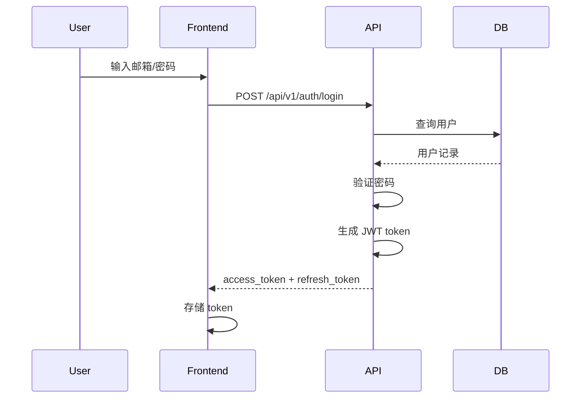
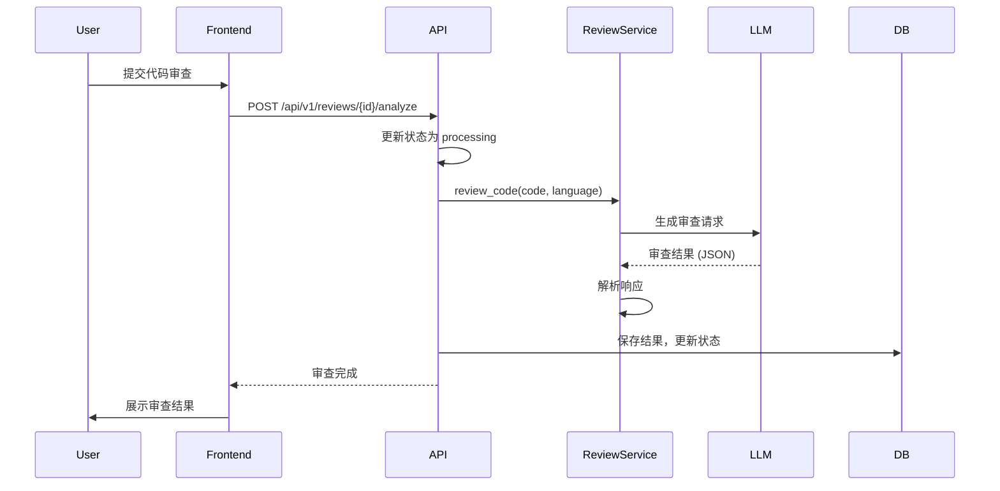
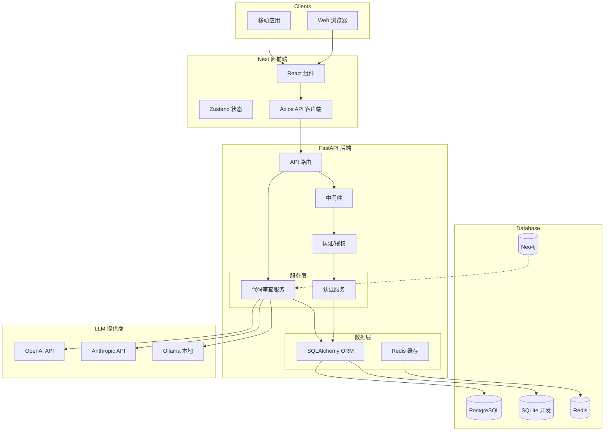
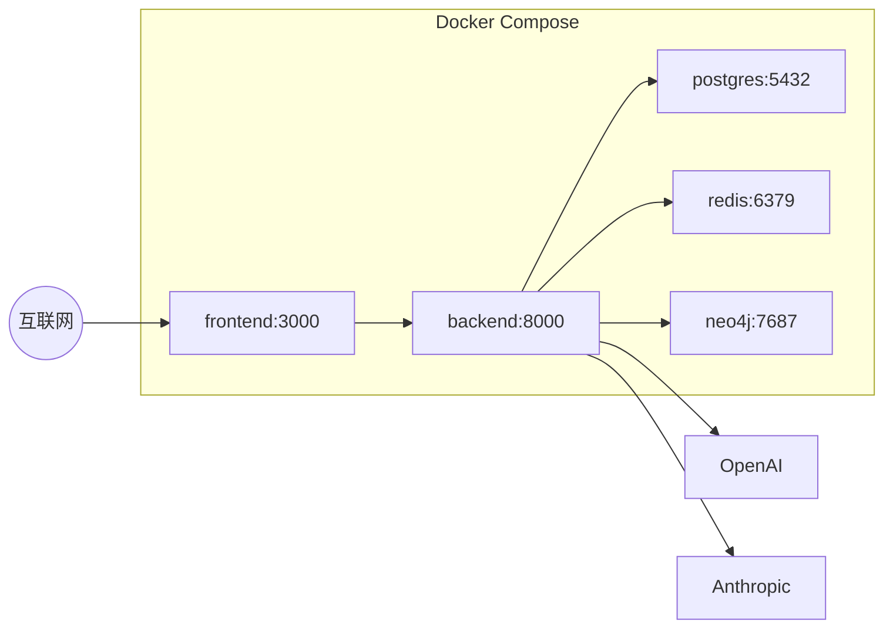

# 系统架构文档

## 概述

AI Code Quality Platform 是一个 AI 驱动的代码质量检查平台，基于 FastAPI (Python) 后端和 Next.js (TypeScript) 前端构建。该平台利用大语言模型（LLM）对代码进行自动化审查，识别安全漏洞、代码质量问题、性能问题和最佳实践违规。

系统支持多租户架构，每个租户可以管理多个项目和代码审查任务。通过集成 OpenAI、Anthropic Claude 和 Ollama 等 LLM 提供商，提供灵活的 AI 能力选择。

## 技术栈

### 语言与运行时
- **Python** 3.10+ (后端)
- **TypeScript** 5.3+ (前端)
- **Node.js** 18+ (前端构建)

### 框架
- **FastAPI** - Python Web 框架
- **SQLAlchemy** - Python ORM (异步)
- **Next.js** 14 - React 框架
- **React Query** - 数据获取和缓存
- **Zustand** - 状态管理

### 数据存储
- **PostgreSQL** 16 - 主数据库 (生产)
- **SQLite** - 开发数据库
- **Redis** 7 - 缓存和会话存储
- **Neo4j** 5 - 图数据库 (代码关系分析)

### 基础设施
- **Docker** - 容器化
- **Docker Compose** - 容器编排
- **Uvicorn** - ASGI 服务器

### 外部服务
- **OpenAI API** - GPT-4 模型
- **Anthropic API** - Claude 模型
- **Ollama** - 本地 LLM 部署

## 项目结构

```
/workspace/
├── backend/                    # FastAPI 后端
│   ├── api/                    # API 路由层
│   │   └── v1/
│   │       ├── auth.py         # 认证端点
│   │       ├── users.py       # 用户管理
│   │       ├── tenants.py     # 租户管理
│   │       ├── projects.py    # 项目管理
│   │       ├── reviews.py     # 代码审查
│   │       └── oauth.py       # OAuth 集成
│   ├── core/                   # 核心模块
│   │   ├── config.py          # 配置管理
│   │   ├── database.py        # 数据库连接
│   │   ├── security.py        # JWT/认证
│   │   ├── permissions.py     # 权限系统
│   │   ├── dependencies.py    # 依赖注入
│   │   ├── exceptions.py      # 异常定义
│   │   └── logging.py         # 日志配置
│   ├── models/                 # SQLAlchemy 模型
│   │   ├── user.py
│   │   ├── tenant.py
│   │   ├── project.py
│   │   ├── review.py
│   │   ├── feature_flag.py
│   │   └── audit_log.py
│   ├── schemas/                # Pydantic 请求/响应模型
│   ├── services/               # 业务逻辑层
│   │   └── code_review.py    # 代码审查服务
│   ├── llm/                   # LLM 集成层
│   │   ├── base.py            # 抽象基类
│   │   ├── openai.py          # OpenAI 提供商
│   │   ├── anthropic.py       # Anthropic 提供商
│   │   ├── ollama.py          # Ollama 提供商
│   │   └── router.py          # LLM 路由
│   └── main.py                # 应用入口
│
├── frontend/                   # Next.js 前端
│   ├── src/
│   │   ├── app/               # Next.js App Router
│   │   ├── lib/               # 工具库
│   │   │   └── api.ts        # API 客户端
│   │   └── stores/            # Zustand 状态存储
│   └── package.json
│
├── infra/                      # 基础设施配置
├── tests/                      # 测试文件
├── data/                       # 数据文件 (SQLite)
└── docker-compose.yml          # 容器编排
```

### 入口点

| 文件 | 描述 |
|------|------|
| `backend/main.py` | FastAPI 应用启动，配置中间件和异常处理 |
| `backend/api/v1/__init__.py` | API 路由聚合 |
| `frontend/src/app/page.tsx` | Next.js 首页 |
| `frontend/src/lib/api.ts` | Axios API 客户端配置 |

## 子系统

### 1. 认证系统 (Authentication)

**目的**: 处理用户注册、登录、JWT 令牌管理和 OAuth 集成

**位置**: `backend/api/v1/auth.py`, `backend/core/security.py`

**关键文件**:
- `auth.py` - 注册、登录、令牌刷新、密码重置
- `security.py` - JWT 创建/验证、密码哈希

**依赖**: 
- `backend/core/config.py` - 配置
- `backend/models/user.py` - 用户模型

**被依赖**:
- 所有需要认证的 API 路由

### 2. 权限系统 (Permissions)

**目的**: 基于角色的访问控制 (RBAC)

**位置**: `backend/core/permissions.py`

**关键组件**:
- `UserRole` - 角色枚举 (superadmin, admin, user, readonly)
- `Permission` - 权限枚举
- `ROLE_PERMISSIONS` - 角色-权限映射

**权限列表**:
- 用户管理: CREATE_USER, READ_USER, UPDATE_USER, DELETE_USER
- 租户管理: CREATE_TENANT, READ_TENANT, UPDATE_TENANT, DELETE_TENANT
- 项目管理: CREATE_PROJECT, READ_PROJECT, UPDATE_PROJECT, DELETE_PROJECT
- 审查管理: CREATE_REVIEW, READ_REVIEW, DELETE_REVIEW
- 分析: RUN_ANALYSIS, READ_ANALYSIS
- 功能开关: MANAGE_FEATURE_FLAGS
- 审计日志: READ_AUDIT_LOGS

### 3. 多租户系统 (Multi-Tenancy)

**目的**: 支持多个独立组织/团队使用同一平台

**位置**: `backend/models/tenant.py`

**关键概念**:
- 每个租户拥有独立的用户、项目和审查记录
- 用户通过 `tenant_id` 关联到租户
- 数据隔离基于租户 ID

### 4. 代码审查系统 (Code Review)

**目的**: 使用 LLM 对代码进行自动化质量分析

**位置**: `backend/services/code_review.py`, `backend/api/v1/reviews.py`

**关键文件**:
- `code_review.py` - 审查服务实现
- `reviews.py` - 审查 API 端点

**功能**:
- 安全漏洞检测 (OWASP Top 10 2021)
- 代码质量问题 (ISO/IEC 25010)
- 性能问题识别
- 代码异味和反模式检测
- 最佳实践违规检查

**工作流程**:
1. 用户提交代码审查请求
2. 系统创建 Review 记录 (pending 状态)
3. 调用 LLM 进行分析
4. 解析 LLM 响应，提取问题
5. 存储审查结果并更新状态

### 5. LLM 集成层 (LLM Integration)

**目的**: 统一的 LLM 调用接口，支持多提供商

**位置**: `backend/llm/`

**关键文件**:
- `base.py` - LLMProvider 抽象基类
- `router.py` - 智能路由和故障转移
- `openai.py` - OpenAI 提供商实现
- `anthropic.py` - Anthropic 提供商实现
- `ollama.py` - Ollama 本地部署实现

**特性**:
- 故障自动转移 (OpenAI → Anthropic → Ollama)
- 可配置默认模型
- 超时和速率限制处理

### 6. 前端应用 (Frontend)

**目的**: 用户界面和 API 交互

**位置**: `frontend/src/`

**关键文件**:
- `lib/api.ts` - Axios 客户端 + 拦截器 (自动 token 刷新)
- `stores/auth.ts` - 认证状态管理

**功能**:
- 登录/注册界面
- 项目管理
- 代码审查结果展示
- 用户设置

## 数据流

### 用户认证流程



### 代码审查流程



## 系统架构图



## 部署架构



## 环境变量

| 变量 | 描述 | 默认值 |
|------|------|--------|
| `DATABASE_TYPE` | 数据库类型 (sqlite/postgres) | sqlite |
| `POSTGRES_*` | PostgreSQL 连接参数 | localhost:5432 |
| `REDIS_*` | Redis 连接参数 | localhost:6379 |
| `NEO4J_*` | Neo4j 连接参数 | localhost:7687 |
| `OPENAI_API_KEY` | OpenAI API 密钥 | - |
| `ANTHROPIC_API_KEY` | Anthropic API 密钥 | - |
| `OLLAMA_BASE_URL` | Ollama 服务地址 | http://localhost:11434 |
| `SECRET_KEY` | JWT 签名密钥 | change-me-in-production |
| `CORS_ORIGINS` | 允许的跨域来源 | http://localhost:3000 |
