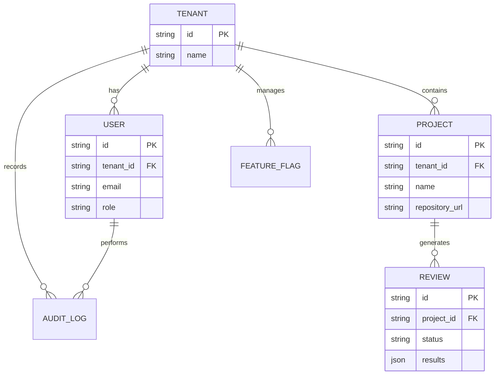

# 开发者指南

## 项目目的

AI Code Quality Platform 是一个 AI 驱动的代码质量检查平台。它使用大语言模型（LLM）自动分析代码，识别安全漏洞、代码质量问题、性能问题和最佳实践违规。

**核心职责**:
- 提供 RESTful API 供前端和第三方集成
- 集成多个 LLM 提供商 (OpenAI, Anthropic, Ollama)
- 管理多租户环境下的用户、项目和审查数据

**相关系统**:
- **前端** - Next.js 用户界面
- **PostgreSQL** - 主数据存储
- **Redis** - 会话和缓存
- **Neo4j** - 代码关系图分析

## 环境搭建

### 前置条件

- **Python** 3.10+
- **Node.js** 18+
- **Docker** & **Docker Compose** (推荐)
- **PostgreSQL** 16+ (可选，使用 SQLite 开发)
- **Redis** 7+ (可选)

### 安装

#### 1. 克隆仓库

```bash
git clone <repository-url>
cd <repository-name>
```

#### 2. 使用 Docker Compose（推荐）

```bash
# 启动所有服务
docker-compose up -d

# 查看日志
docker-compose logs -f backend

# 停止服务
docker-compose down
```

服务端口：
- 前端: http://localhost:3000
- 后端: http://localhost:8000
- PostgreSQL: localhost:5432
- Redis: localhost:6379
- Neo4j: http://localhost:7474

#### 3. 本地开发（不使用 Docker）

**后端**:

```bash
cd backend

# 创建虚拟环境
python -m venv venv
source venv/bin/activate  # Linux/Mac
# 或 venv\Scripts\activate  # Windows

# 安装依赖
pip install -r requirements.txt

# 启动开发服务器
uvicorn backend.main:app --reload --host 0.0.0.0 --port 8000
```

**前端**:

```bash
cd frontend

# 安装依赖
npm install

# 启动开发服务器
npm run dev
```

### 环境变量

| 变量 | 必需 | 描述 | 示例 |
|------|------|------|------|
| `DATABASE_TYPE` | 否 | 数据库类型 (sqlite/postgres) | `sqlite` |
| `SECRET_KEY` | 是 | JWT 签名密钥 | `your-secret-key` |
| `OPENAI_API_KEY` | 否 | OpenAI API 密钥 | `sk-...` |
| `ANTHROPIC_API_KEY` | 否 | Anthropic API 密钥 | `sk-ant-...` |
| `OLLAMA_BASE_URL` | 否 | Ollama 服务地址 | `http://localhost:11434` |
| `CORS_ORIGINS` | 否 | 允许的跨域来源 | `["http://localhost:3000"]` |

**注意**: 绝不提交密钥到版本控制。使用 `.env` 文件或密钥管理器。

### 运行

```bash
# Docker (推荐)
docker-compose up -d

# 后端独立
cd backend && uvicorn backend.main:app --reload

# 前端独立
cd frontend && npm run dev

# 生产构建
cd frontend && npm run build && npm run start
```

## 开发工作流

### 代码质量工具

| 工具 | 命令 | 目的 |
|------|------|------|
| Python Lint | `flake8` | 代码风格检查 |
| TypeScript | `npm run typecheck` | 类型检查 (前端) |
| ESLint | `npm run lint` | 代码检查 (前端) |
| Prettier | `npm run format` | 代码格式化 |
| Tests | `pytest` | Python 测试 |

### 分支策略

- `main` - 生产就绪代码
- `feature/*` - 新功能开发
- `fix/*` - Bug 修复
- `refactor/*` - 代码重构

### Pull Request 流程

1. 从 `main` 创建功能分支
2. 编写代码和测试
3. 运行代码检查
4. 创建 PR 并填写描述
5. 处理审查反馈
6. Squash 合并

## 常见任务

### 添加新 API 端点

**需修改的文件**:
1. `backend/api/v1/[domain].py` - 添加路由处理器
2. `backend/services/[domain].py` - 添加业务逻辑 (如需要)
3. `backend/schemas/[domain].py` - 添加请求/响应模型

**步骤**:
1. 在路由文件中定义路由
2. 实现服务方法
3. 添加输入验证 (Pydantic)
4. 配置权限检查
5. 编写测试

**示例**:

```python
# backend/api/v1/examples.py
from fastapi import APIRouter, Depends
from backend.core.dependencies import CurrentUser, require_permission
from backend.core.permissions import Permission

router = APIRouter(prefix="/examples", tags=["Examples"])

@router.get("")
async def list_examples(
    user: CurrentUser = Depends(require_permission(Permission.READ_PROJECT)),
    db: AsyncSession = Depends(get_db),
):
    # 业务逻辑
    return examples
```

### 添加新数据模型

**需修改的文件**:
1. `backend/models/[model_name].py` - SQLAlchemy 模型
2. `backend/schemas/[model_name].py` - Pydantic 模式
3. 数据库迁移 (如使用 Alembic)

**步骤**:
1. 创建 SQLAlchemy 模型类
2. 定义表结构和关系
3. 创建 Pydantic 模式 (Create, Update, Response)
4. 注册到 `backend/models/__init__.py`
5. 注册到 `backend/schemas/__init__.py`

### 添加 LLM 提供商

**需修改的文件**:
1. `backend/llm/[provider].py` - 提供商实现
2. `backend/llm/router.py` - 注册提供商

**步骤**:
1. 实现 `LLMProvider` 抽象基类
2. 实现 `generate()` 和 `validate_connection()` 方法
3. 在 `LLMRouter._initialize_default_providers()` 中注册
4. 添加环境变量配置

### 修复 Bug

**流程**:
1. 编写复现 bug 的失败测试
2. 在代码中定位根因
3. 用最小改动修复
4. 验证测试通过
5. 检查其他地方是否有类似问题

## 编码规范

### Python (后端)

**文件组织**:
- 每个模块一个目录
- `__init__.py` 导出公开 API
- 相关的模型、服务放同一目录

**命名约定**:

| 类型 | 约定 | 示例 |
|------|------|------|
| 文件 | snake_case | `user_service.py` |
| 类 | PascalCase | `UserService` |
| 函数 | snake_case | `get_user_by_id` |
| 常量 | UPPER_SNAKE | `MAX_RETRIES` |

**错误处理**:

```python
# 推荐：使用自定义异常
from backend.core.exceptions import NotFoundException

raise NotFoundException("User", user_id)

# 避免：通用错误
raise Exception("User not found")
```

**日志**:

```python
from backend.core.logging import logger

logger.info("User created", {"user_id": user_id})
logger.warning("Rate limit approaching", {"user_id": user_id})
logger.error("Failed to process", {"error": str(e)})
```

### TypeScript/React (前端)

**文件组织**:
- 组件: `components/[Name].tsx`
- 页面: `app/[path]/page.tsx`
- API: `lib/api.ts`
- 状态: `stores/[name].ts`

**命名约定**:

| 类型 | 约定 | 示例 |
|------|------|------|
| 文件 | kebab-case | `user-service.ts` |
| 组件 | PascalCase | `UserProfile` |
| 函数 | camelCase | `getUserById` |
| 常量 | UPPER_SNAKE | `MAX_RETRIES` |

**组件模式**:

```typescript
// 使用 TypeScript 接口定义 props
interface ButtonProps {
  onClick: () => void;
  children: React.ReactNode;
  variant?: 'primary' | 'secondary';
}

export function Button({ onClick, children, variant = 'primary' }: ButtonProps) {
  return (
    <button 
      className={cn('btn', `btn-${variant}`)}
      onClick={onClick}
    >
      {children}
    </button>
  );
}
```

### 测试

**Python (后端)**:

```python
import pytest
from backend.main import app

@pytest.fixture
def client():
    # 设置测试客户端
    pass

def test_health_check(client):
    response = client.get("/health")
    assert response.status_code == 200
    assert response.json()["status"] == "healthy"
```

**TypeScript (前端)**:

```typescript
// 测试文件: components/Button.test.tsx
import { render, screen } from '@testing-library/react';
import { Button } from './Button';

describe('Button', () => {
  it('should render children', () => {
    render(<Button>Click me</Button>);
    expect(screen.getByText('Click me')).toBeInTheDocument();
  });
});
```

## 项目结构详解

### 后端目录

```
backend/
├── api/v1/           # API 路由层
│   ├── auth.py       # 认证 (注册/登录/token)
│   ├── users.py      # 用户管理
│   ├── tenants.py    # 租户管理
│   ├── projects.py   # 项目管理
│   ├── reviews.py    # 代码审查
│   └── oauth.py     # OAuth 集成
├── core/             # 核心模块
│   ├── config.py     # 配置 (Settings)
│   ├── database.py   # SQLAlchemy 配置
│   ├── security.py   # JWT/密码
│   ├── permissions.py # RBAC 权限
│   ├── dependencies.py # 依赖注入
│   ├── exceptions.py  # 自定义异常
│   └── logging.py    # 日志配置
├── models/           # SQLAlchemy 模型
│   ├── user.py       # 用户
│   ├── tenant.py     # 租户
│   ├── project.py    # 项目
│   └── review.py     # 代码审查
├── schemas/          # Pydantic 模式
├── services/         # 业务逻辑
│   └── code_review.py # 代码审查服务
└── llm/              # LLM 集成
    ├── base.py       # 抽象基类
    ├── router.py     # 智能路由
    ├── openai.py     # OpenAI
    ├── anthropic.py  # Anthropic
    └── ollama.py     # Ollama
```

### 前端目录

```
frontend/
├── src/
│   ├── app/          # Next.js App Router
│   │   ├── layout.tsx
│   │   ├── page.tsx  # 首页
│   │   └── (其他页面)
│   ├── lib/          # 工具库
│   │   └── api.ts    # Axios 客户端
│   └── stores/       # Zustand 状态
│       └── auth.ts   # 认证状态
└── package.json
```

## 数据库模型关系



## 扩展开发

### 添加新的 LLM 提供商

1. 在 `backend/llm/` 目录创建新文件，如 `google.py`
2. 继承 `LLMProvider` 基类
3. 实现必要的方法
4. 在 `router.py` 中注册

### 添加新的 API 端点

1. 在 `backend/api/v1/` 创建或编辑路由文件
2. 使用依赖注入获取当前用户和数据库会话
3. 添加权限检查
4. 返回 Pydantic 模型响应

### 添加新的数据模型

1. 在 `backend/models/` 创建模型类
2. 在 `backend/schemas/` 创建对应的 Pydantic 模式
3. 运行数据库迁移（如使用 Alembic）
