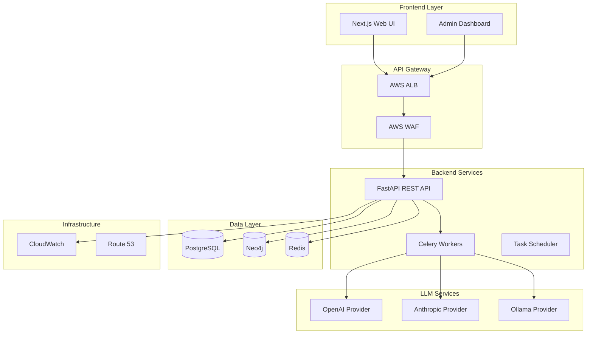

# AI Code Quality Platform

Feature Name: ai-code-quality-platform
Updated: 2026-03-12

## Description

全面的 AI 驱动的代码和架构质量检查平台，采用微服务 + 多层架构设计，支持多租户企业级部署。系统通过 AI 技术自动分析代码质量、检测安全漏洞、评估架构设计，并提供可视化报告。

## Architecture



## Components and Interfaces

### 1. API Service (FastAPI)

| Component | Responsibility | Port |
|-----------|----------------|------|
| `api/main.py` | 应用入口，路由配置 | 8000 |
| `api/auth/` | JWT 认证，OAuth 集成 | - |
| `api/projects/` | 项目 CRUD 操作 | - |
| `api/reviews/` | 代码审查 API | - |
| `api/analysis/` | 架构分析 API | - |
| `api/admin/` | 管理功能，Feature Flags | - |

### 2. LLM Integration Layer

| Component | Responsibility |
|-----------|----------------|
| `llm/base.py` | LLM 抽象基类 |
| `llm/openai.py` | OpenAI 提供商实现 |
| `llm/anthropic.py` | Anthropic 提供商实现 |
| `llm/ollama.py` | Ollama 本地模型实现 |
| `llm/router.py` | LLM 路由和故障转移 |

### 3. Analysis Engine

| Component | Responsibility |
|-----------|----------------|
| `analysis/code_parser.py` | 代码解析（多语言支持） |
| `analysis/reviewer.py` | 代码审查逻辑 |
| `analysis/architect.py` | 架构分析逻辑 |
| `analysis/dependency.py` | 依赖关系提取 |

### 4. Data Layer

| Component | Responsibility |
|-----------|----------------|
| `models/user.py` | 用户和租户模型 |
| `models/project.py` | 项目和仓库模型 |
| `models/review.py` | 审查结果模型 |
| `repositories/` | 数据访问层 |

### 5. Frontend (Next.js)

| Component | Responsibility |
|-----------|----------------|
| `app/` | Next.js App Router 页面 |
| `components/` | React 组件库 |
| `stores/` | Zustand 状态管理 |
| `hooks/` | React Query 数据获取 |

## Data Models

### PostgreSQL Schema

```sql
-- Tenants (Multi-tenant)
CREATE TABLE tenants (
    id UUID PRIMARY KEY DEFAULT gen_random_uuid(),
    name VARCHAR(255) NOT NULL,
    settings JSONB DEFAULT '{}',
    created_at TIMESTAMP DEFAULT NOW()
);

-- Users
CREATE TABLE users (
    id UUID PRIMARY KEY DEFAULT gen_random_uuid(),
    tenant_id UUID REFERENCES tenants(id),
    email VARCHAR(255) UNIQUE NOT NULL,
    password_hash VARCHAR(255),
    role VARCHAR(50) DEFAULT 'user',
    created_at TIMESTAMP DEFAULT NOW()
);

-- Projects
CREATE TABLE projects (
    id UUID PRIMARY KEY DEFAULT gen_random_uuid(),
    tenant_id UUID REFERENCES tenants(id),
    name VARCHAR(255) NOT NULL,
    repository_url VARCHAR(500),
    settings JSONB DEFAULT '{}',
    created_at TIMESTAMP DEFAULT NOW()
);

-- Reviews
CREATE TABLE reviews (
    id UUID PRIMARY KEY DEFAULT gen_random_uuid(),
    project_id UUID REFERENCES projects(id),
    commit_sha VARCHAR(40),
    status VARCHAR(50),
    results JSONB,
    created_at TIMESTAMP DEFAULT NOW()
);

-- Feature Flags
CREATE TABLE feature_flags (
    id UUID PRIMARY KEY DEFAULT gen_random_uuid(),
    tenant_id UUID REFERENCES tenants(id),
    name VARCHAR(100) NOT NULL,
    enabled BOOLEAN DEFAULT false,
    rules JSONB DEFAULT '{}',
    created_at TIMESTAMP DEFAULT NOW()
);

-- Audit Logs
CREATE TABLE audit_logs (
    id UUID PRIMARY KEY DEFAULT gen_random_uuid(),
    tenant_id UUID REFERENCES tenants(id),
    user_id UUID REFERENCES users(id),
    action VARCHAR(100) NOT NULL,
    details JSONB,
    ip_address INET,
    created_at TIMESTAMP DEFAULT NOW()
);
```

### Neo4j Schema

```cypher
// Code Entities
CREATE CONSTRAINT IF NOT EXISTS FOR (m:Module) REQUIRE m.id IS UNIQUE;
CREATE CONSTRAINT IF NOT EXISTS FOR (c:Class) REQUIRE c.id IS UNIQUE;
CREATE CONSTRAINT IF NOT EXISTS FOR (f:Function) REQUIRE f.id IS UNIQUE;

// Dependencies
CREATE CONSTRAINT IF NOT EXISTS FOR ()-[r:DEPENDS_ON]-() REQUIRE r.id IS UNIQUE;
CREATE CONSTRAINT IF NOT EXISTS FOR ()-[r:CALLS]-() REQUIRE r.id IS UNIQUE;
CREATE CONSTRAINT IF NOT EXISTS FOR ()-[r:INHERITS]-() REQUIRE r.id IS UNIQUE;
```

## Correctness Properties

| Property | Invariant |
|----------|-----------|
| 数据隔离 | 租户间的数据必须完全隔离，跨租户查询返回空 |
| 认证有效 | JWT 令牌过期后必须重新认证 |
| 授权一致 | 权限变更必须在当前会话中生效 |
| LLM 容错 | 主 LLM 失败时自动切换备用提供商 |
| 任务幂等 | 相同任务的重复提交只执行一次 |
| 审计完整 | 所有敏感操作必须记录审计日志 |

## Error Handling

| Error Type | Handling Strategy |
|------------|-------------------|
| AuthenticationError | 返回 401，提示重新登录 |
| AuthorizationError | 返回 403，说明权限不足 |
| ResourceNotFoundError | 返回 404，提供资源不存在信息 |
| ValidationError | 返回 400，列出具体验证错误 |
| LLMTimeoutError | 切换 LLM 提供商，超时 30s |
| DatabaseError | 返回 500，记录详细错误日志 |
| RateLimitError | 返回 429，提示重试时间 |

## Test Strategy

### Unit Tests
- 覆盖率目标: 80%+
- 测试框架: pytest
- Mock LLM 调用

### Integration Tests
- API 端点测试
- 数据库操作测试
- Redis 缓存测试

### E2E Tests
- Playwright 端到端测试
- 用户流程测试

### Performance Tests
- Locust 负载测试
- 目标: 1000 QPS

## Deployment Architecture

```mermaid
graph TB
    subgraph "AWS Cloud"
        subgraph "VPC (10.0.0.0/16)"
            subgraph "Public Subnets (AZ1, AZ2)"
                ALB[Application Load Balancer]
            end
            
            subgraph "Private Subnets (AZ1, AZ2)"
                EC2A[EC2 - API Server]
                EC2B[EC2 - Celery Worker]
                EC2C[EC2 - Frontend]
            end
            
            subgraph "Data Layer"
                RDS[(RDS PostgreSQL)]
                ElastiCache[(ElastiCache Redis)]
                Neo4j[(Neo4j AuraDB)]
            end
        end
        
        WAF[AWS WAF]
        CW[CloudWatch]
        S3[S3 - Assets]
    end

    Users --> WAF
    WAF --> ALB
    ALB --> EC2A
    ALB --> EC2C
    EC2A --> RDS
    EC2A --> ElastiCache
    EC2A --> Neo4j
    EC2A --> S3
    EC2B --> RDS
    EC2B --> Neo4j
    EC2B --> ElastiCache
    EC2A --> CW
    EC2B --> CW
end
```

## Terraform Modules

| Module | Resources |
|--------|-----------|
| `modules/vpc` | VPC, Subnets, Route Tables, NAT Gateway |
| `modules/security` | Security Groups, IAM Roles, WAF Rules |
| `modules/ecs` | ECS Cluster, Services, Tasks |
| `modules/rds` | RDS PostgreSQL, Subnet Group |
| `modules/elasticache` | ElastiCache Redis, Subnet Group |
| `modules/alb` | ALB, Target Groups, Listeners |
| `modules/cloudwatch` | Log Groups, Dashboards, Alarms |

## Implementation Phases

### Phase 1: Foundation (Week 1-4)
- 项目结构搭建
- 数据库设计实现
- 用户认证系统
- RBAC 权限系统

### Phase 2: Core Features (Week 5-12)
- LLM 集成层
- 代码审查引擎
- 架构分析引擎
- 依赖图谱

### Phase 3: Frontend (Week 13-20)
- Next.js 基础架构
- 项目管理界面
- 审查结果展示
- 管理后台

### Phase 4: Integration (Week 21-28)
- GitHub PR 集成
- Feature Flag 系统
- WebSocket 实时通知
- 审计日志系统

### Phase 5: Deployment (Week 29-40)
- Terraform AWS 部署
- CI/CD 流水线
- 监控告警系统
- 性能优化

## References

- FastAPI: https://fastapi.tiangolo.com/
- Next.js: https://nextjs.org/
- Neo4j: https://neo4j.com/
- AWS Terraform: https://registry.terraform.io/providers/hashicorp/aws
- OWASP Top 10 2021: https://owasp.org/www-project-top-ten/
- ISO/IEC 25010: https://iso25000.com/index.php/en/iso-25000-standards/iso-25010

