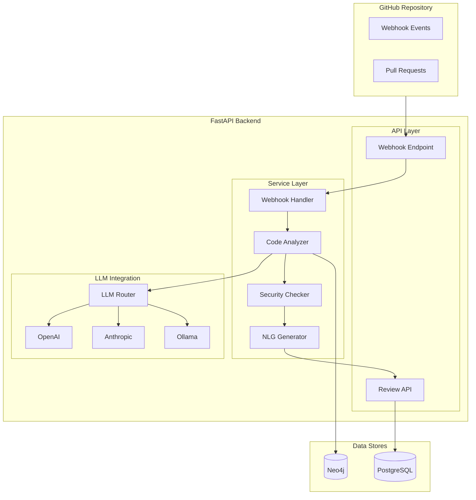

# AI Code Review

Feature Name: ai-code-review
Updated: 2026-03-12

## Description

AI Code Review is an automated code quality analysis system that integrates with GitHub Webhooks to receive push and pull request events, uses Agentic AI to perform deep code logic scanning, identifies violations of Clean Code principles and ISO/IEC 25010 standards, cross-references OWASP Top 10 for security vulnerabilities, and generates human-readable review suggestions using NLG.

## Architecture



## Components and Interfaces

### 1. Webhook Handler

**Responsibility**: Receive and validate GitHub webhook events

**Public Interface**:
- `handle_push_event(payload: WebhookPayload) -> ReviewRequest`
- `handle_pull_request_event(payload: WebhookPayload) -> ReviewRequest`
- `validate_webhook_signature(payload: bytes, signature: str) -> bool`

**Location**: `backend/services/webhook_handler.py`

### 2. Code Analyzer

**Responsibility**: Perform deep code logic analysis using Agentic AI

**Public Interface**:
- `analyze_code(code: str, language: str, rules: List[Rule]) -> AnalysisResult`
- `detect_code_smells(code: str) -> List[CodeSmell]`
- `check_architecture_violations(code: str) -> List[Violation]`

**Location**: `backend/services/code_analyzer.py`

### 3. Security Checker

**Responsibility**: Cross-reference security knowledge bases

**Public Interface**:
- `check_owasp_compliance(code: str) -> List[SecurityIssue]`
- `check_cve_references(issue_type: str) -> Optional[CVEInfo]`
- `check_google_style(code: str, language: str) -> List[StyleViolation]`

**Location**: `backend/services/security_checker.py`

### 4. NLG Review Generator

**Responsibility**: Generate human-readable review suggestions

**Public Interface**:
- `generate_review(analysis: AnalysisResult) -> ReviewReport`
- `format_github_comment(report: ReviewReport) -> str`
- `format_markdown(report: ReviewReport) -> str`

**Location**: `backend/services/review_generator.py`

### API Endpoints

| Endpoint | Method | Description |
|----------|--------|-------------|
| `/api/v1/webhooks/github` | POST | Receive GitHub webhook events |
| `/api/v1/webhooks/github/configure` | POST | Configure webhook for repository |
| `/api/v1/reviews/{id}` | GET | Get review result |
| `/api/v1/reviews/{id}/status` | GET | Get review status |
| `/api/v1/projects/{id}/rules` | GET | Get project analysis rules |
| `/api/v1/projects/{id}/rules` | PUT | Update project analysis rules |

## Data Models

### ReviewRequest

```python
class ReviewRequest(BaseModel):
    id: UUID
    project_id: UUID
    commit_sha: str
    branch: str
    changed_files: List[FileChange]
    trigger_type: str  # push, pull_request
    status: ReviewStatus
    created_at: datetime
    completed_at: Optional[datetime]
```

### FileChange

```python
class FileChange(BaseModel):
    filename: str
    status: str  # added, modified, deleted
    diff: Optional[str]
    old_content: Optional[str]
    new_content: Optional[str]
    language: str
```

### AnalysisResult

```python
class AnalysisResult(BaseModel):
    review_id: UUID
    issues: List[CodeIssue]
    summary: str
    scores: QualityScores
    processed_at: datetime
```

### CodeIssue

```python
class CodeIssue(BaseModel):
    id: UUID
    severity: SeverityLevel  # critical, major, minor, info
    category: IssueCategory  # clean_code, security, performance, best_practice
    title: str
    description: str
    file: str
    line_start: int
    line_end: int
    suggested_fix: Optional[str]
    references: List[str]  # OWASP, CVE, style guide links
```

### ProjectRuleConfig

```python
class ProjectRuleConfig(BaseModel):
    project_id: UUID
    enabled_categories: List[IssueCategory]
    severity_thresholds: Dict[str, SeverityLevel]
    disabled_rules: List[str]
    preferred_llm_provider: Optional[str]
```

## Database Schema

### Table: reviews

| Column | Type | Description |
|--------|------|-------------|
| id | UUID | Primary key |
| project_id | UUID | Foreign key to projects |
| commit_sha | VARCHAR(40) | Git commit SHA |
| branch | VARCHAR(255) | Branch name |
| trigger_type | VARCHAR(50) | push, pull_request |
| status | ENUM | pending, processing, completed, failed |
| summary | TEXT | NLG generated summary |
| scores_json | JSONB | Quality scores |
| created_at | TIMESTAMP | Creation time |
| completed_at | TIMESTAMP | Completion time |

### Table: review_issues

| Column | Type | Description |
|--------|------|-------------|
| id | UUID | Primary key |
| review_id | UUID | Foreign key to reviews |
| severity | ENUM | critical, major, minor, info |
| category | VARCHAR(50) | Issue category |
| title | VARCHAR(255) | Issue title |
| description | TEXT | Issue description |
| file | VARCHAR(500) | File path |
| line_start | INTEGER | Start line |
| line_end | INTEGER | End line |
| suggested_fix | TEXT | Suggested fix |
| references | JSONB | Reference links |

### Table: webhook_configs

| Column | Type | Description |
|--------|------|-------------|
| id | UUID | Primary key |
| project_id | UUID | Foreign key to projects |
| repository_url | VARCHAR(255) | GitHub repo URL |
| webhook_secret | VARCHAR(255) | HMAC secret |
| webhook_id | VARCHAR(50) | GitHub webhook ID |
| enabled_events | JSONB | Enabled event types |
| is_active | BOOLEAN | Active status |

## Correctness Properties

### Invariants

1. Every review MUST have a valid project reference
2. Every issue MUST reference its parent review
3. Webhook payload MUST pass signature validation before processing
4. Analysis results MUST be persisted before returning success

### Constraints

1. Maximum 100 files per single review request
2. Maximum file size: 100KB per file
3. Supported languages: Python, JavaScript, TypeScript, Java, Go, Rust, C#
4. Analysis timeout: 120 seconds per file

## Error Handling

### Webhook Errors

| Scenario | HTTP Code | Response |
|----------|-----------|----------|
| Invalid payload format | 400 | `{ "error": "invalid_payload", "details": ... }` |
| Missing signature | 401 | `{ "error": "missing_signature" }` |
| Invalid signature | 401 | `{ "error": "invalid_signature" }` |
| Unsupported event type | 200 | `{ "message": "event_not_supported" }` (no processing) |

### Analysis Errors

| Scenario | Handling |
|----------|----------|
| LLM provider timeout | Retry with next provider, max 3 retries |
| LLM provider rate limit | Queue request, retry after cooldown |
| Invalid response format | Log error, mark review as failed |
| File parse error | Skip file, continue with others |

## Test Strategy

### Unit Tests

- Webhook signature validation
- Payload parsing
- Rule configuration serialization
- NLG template rendering

### Integration Tests

- End-to-end webhook flow
- Multi-provider failover
- Database persistence

### Mock Tests

- GitHub webhook payloads
- LLM API responses
- Security check patterns

## References

[^1]: [OWASP Top 10 2021](https://owasp.org/www-project-top-ten/)
[^2]: [Clean Code by Robert C. Martin](https://www.oreilly.com/library/view/clean-code/9780136083238/)
[^3]: [ISO/IEC 25010:2011](https://www.iso.org/standard/35733.html)
[^4]: [Google Style Guides](https://google.github.io/styleguide/)
