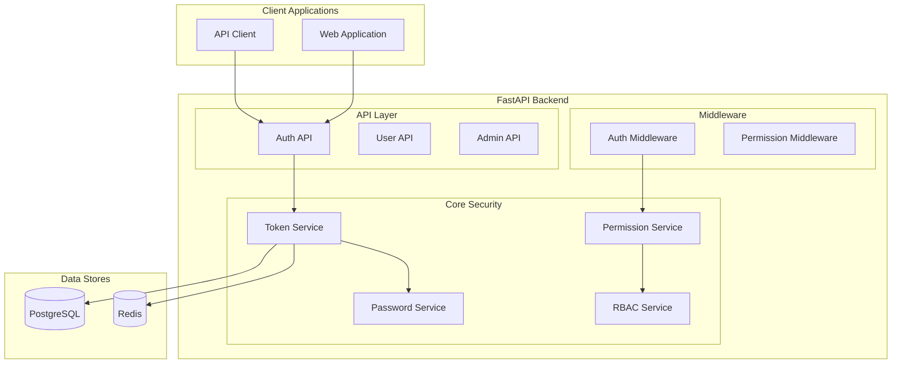

# Authenticated System

Feature Name: authenticated-system
Updated: 2026-03-12

## Description

Authenticated System provides RBAC-based authentication and authorization for the AI Code Quality Platform. It supports three roles (Administrator, Programmer, Guest), protects sensitive architecture configuration and analysis reports, and enforces multi-tenant data isolation.

## Architecture



## Components and Interfaces

### 1. Token Service

**Responsibility**: Generate and validate JWT tokens

**Public Interface**:
- `create_access_token(user: User, tenant_id: UUID) -> str`
- `create_refresh_token(user: User) -> str`
- `verify_token(token: str) -> TokenPayload`
- `refresh_access_token(refresh_token: str) -> TokenPair`

**Location**: `backend/core/security.py`

### 2. Password Service

**Responsibility**: Hash and verify passwords

**Public Interface**:
- `hash_password(password: str) -> str`
- `verify_password(plain: str, hashed: str) -> bool`
- `validate_password_strength(password: str) -> ValidationResult`

**Location**: `backend/core/security.py`

### 3. Permission Service

**Responsibility**: Check user permissions

**Public Interface**:
- `check_permission(user: User, permission: Permission) -> bool`
- `check_project_access(user: User, project: Project) -> bool`
- `get_user_permissions(user: User) -> Set[Permission]`

**Location**: `backend/core/permissions.py`

### 4. RBAC Service

**Responsibility**: Manage role-based access control

**Public Interface**:
- `assign_role(user: User, role: UserRole, tenant_id: UUID) -> None`
- `revoke_role(user: User, role: UserRole, tenant_id: UUID) -> None`
- `get_role_permissions(role: UserRole) -> Set[Permission]`
- `is_tenant_admin(user: User, tenant_id: UUID) -> bool`

**Location**: `backend/core/rbac.py`

### API Endpoints

| Endpoint | Method | Description |
|----------|--------|-------------|
| `/api/v1/auth/register` | POST | Register new user |
| `/api/v1/auth/login` | POST | Login with credentials |
| `/api/v1/auth/refresh` | POST | Refresh access token |
| `/api/v1/auth/logout` | POST | Invalidate tokens |
| `/api/v1/auth/me` | GET | Get current user info |
| `/api/v1/users` | GET | List users (admin) |
| `/api/v1/users/{id}` | GET | Get user details |
| `/api/v1/users/{id}/role` | PUT | Update user role |
| `/api/v1/tenants` | POST | Create tenant |
| `/api/v1/tenants/{id}` | GET | Get tenant info |

## Role Definitions

### Role Hierarchy

```
Superadmin (Platform-wide)
├── Administrator (Tenant-wide)
│   ├── Programmer (Project access)
│   │   └── Guest (Read-only)
```

### Permission Matrix

| Permission | Superadmin | Administrator | Programmer | Guest |
|------------|------------|--------------|------------|-------|
| CREATE_TENANT | ✓ | ✗ | ✗ | ✗ |
| READ_TENANT | ✓ | ✓ (own) | ✗ | ✗ |
| UPDATE_TENANT | ✓ | ✓ (own) | ✗ | ✗ |
| DELETE_TENANT | ✓ | ✗ | ✗ | ✗ |
| CREATE_USER | ✓ | ✓ (own tenant) | ✗ | ✗ |
| READ_USER | ✓ | ✓ (own tenant) | ✗ | ✗ |
| UPDATE_USER | ✓ | ✓ (own tenant) | ✗ | ✗ |
| DELETE_USER | ✓ | ✓ (own tenant) | ✗ | ✗ |
| CREATE_PROJECT | ✓ | ✓ | ✓ | ✗ |
| READ_PROJECT | ✓ | ✓ (own) | ✓ (own) | ✓ (public) |
| UPDATE_PROJECT | ✓ | ✓ (own) | ✓ (own) | ✗ |
| DELETE_PROJECT | ✓ | ✓ (own) | ✗ | ✗ |
| CREATE_REVIEW | ✓ | ✓ | ✓ | ✗ |
| READ_REVIEW | ✓ | ✓ (own) | ✓ (own) | ✓ (public) |
| DELETE_REVIEW | ✓ | ✓ (own) | ✓ (own) | ✗ |
| READ_ARCHITECTURE_CONFIG | ✓ | ✓ | ✓ | ✗ |
| UPDATE_ARCHITECTURE_CONFIG | ✓ | ✓ | ✓ | ✗ |
| READ_ANALYSIS_REPORT | ✓ | ✓ | ✓ | ✓ (public) |
| MANAGE_API_KEYS | ✓ | ✓ | ✗ | ✗ |
| VIEW_AUDIT_LOGS | ✓ | ✓ (own) | ✗ | ✗ |

## Data Models

### User

```python
class User(BaseModel):
    id: UUID
    email: str
    username: str
    hashed_password: str
    full_name: Optional[str]
    is_active: bool
    is_superuser: bool
    created_at: datetime
    updated_at: datetime
```

### UserRole

```python
class UserRole(BaseModel):
    id: UUID
    user_id: UUID
    tenant_id: UUID
    role: Role  # superadmin, admin, programmer, guest
    created_at: datetime
    created_by: UUID
```

### Tenant

```python
class Tenant(BaseModel):
    id: UUID
    name: str
    slug: str
    is_active: bool
    plan: str  # free, pro, enterprise
    created_at: datetime
    updated_at: datetime
```

### Project

```python
class Project(BaseModel):
    id: UUID
    tenant_id: UUID
    name: str
    slug: str
    description: Optional[str]
    repository_url: Optional[str]
    is_public: bool
    created_by: UUID
    created_at: datetime
    updated_at: datetime
```

### APIKey

```python
class APIKey(BaseModel):
    id: UUID
    user_id: UUID
    name: str
    key_hash: str
    last_used_at: Optional[datetime]
    expires_at: Optional[datetime]
    created_at: datetime
```

## Database Schema

### Table: users

| Column | Type | Constraints |
|--------|------|-------------|
| id | UUID | PK |
| email | VARCHAR(255) | UNIQUE, NOT NULL |
| username | VARCHAR(100) | UNIQUE, NOT NULL |
| hashed_password | VARCHAR(255) | NOT NULL |
| full_name | VARCHAR(255) | |
| is_active | BOOLEAN | DEFAULT TRUE |
| is_superuser | BOOLEAN | DEFAULT FALSE |
| created_at | TIMESTAMP | NOT NULL |
| updated_at | TIMESTAMP | NOT NULL |

### Table: user_roles

| Column | Type | Constraints |
|--------|------|-------------|
| id | UUID | PK |
| user_id | UUID | FK -> users.id |
| tenant_id | UUID | FK -> tenants.id |
| role | VARCHAR(50) | NOT NULL |
| created_at | TIMESTAMP | NOT NULL |
| created_by | UUID | FK -> users.id |

### Table: tenants

| Column | Type | Constraints |
|--------|------|-------------|
| id | UUID | PK |
| name | VARCHAR(255) | NOT NULL |
| slug | VARCHAR(100) | UNIQUE, NOT NULL |
| is_active | BOOLEAN | DEFAULT TRUE |
| plan | VARCHAR(50) | DEFAULT 'free' |
| created_at | TIMESTAMP | NOT NULL |
| updated_at | TIMESTAMP | NOT NULL |

### Table: projects

| Column | Type | Constraints |
|--------|------|-------------|
| id | UUID | PK |
| tenant_id | UUID | FK -> tenants.id |
| name | VARCHAR(255) | NOT NULL |
| slug | VARCHAR(100) | |
| description | TEXT | |
| repository_url | VARCHAR(500) | |
| is_public | BOOLEAN | DEFAULT FALSE |
| created_by | UUID | FK -> users.id |
| created_at | TIMESTAMP | NOT NULL |
| updated_at | TIMESTAMP | NOT NULL |

### Table: api_keys

| Column | Type | Constraints |
|--------|------|-------------|
| id | UUID | PK |
| user_id | UUID | FK -> users.id |
| name | VARCHAR(100) | NOT NULL |
| key_hash | VARCHAR(255) | NOT NULL |
| last_used_at | TIMESTAMP | |
| expires_at | TIMESTAMP | |
| created_at | TIMESTAMP | NOT NULL |

### Table: audit_logs

| Column | Type | Constraints |
|--------|------|-------------|
| id | UUID | PK |
| user_id | UUID | FK -> users.id |
| tenant_id | UUID | FK -> tenants.id |
| action | VARCHAR(100) | NOT NULL |
| resource_type | VARCHAR(50) | NOT NULL |
| resource_id | UUID | |
| ip_address | VARCHAR(45) | |
| user_agent | VARCHAR(500) | |
| created_at | TIMESTAMP | NOT NULL |

## Security Implementation

### JWT Token Structure

**Access Token Payload**:
```python
{
    "sub": user_id,
    "tenant_id": tenant_id,
    "role": role,
    "exp": expiration_time,
    "iat": issued_at,
    "type": "access"
}
```

**Refresh Token Payload**:
```python
{
    "sub": user_id,
    "exp": expiration_time,
    "iat": issued_at,
    "type": "refresh"
}
```

### Password Requirements

- Minimum 8 characters
- At least 1 uppercase letter
- At least 1 lowercase letter
- At least 1 number
- At least 1 special character

### Rate Limiting

- Login: 5 attempts per minute per IP
- API requests: 1000 requests per hour per user
- Token refresh: 10 attempts per hour per user

## Correctness Properties

### Invariants

1. Every user MUST have at least one role within a tenant
2. User with role must belong to that role's tenant
3. Project must have a tenant owner
4. All protected endpoints MUST verify permissions before execution

### Constraints

1. Maximum 10 tenants per platform (free plan)
2. Maximum 100 users per tenant (free plan)
3. Maximum 50 projects per tenant (free plan)
4. API key maximum: 5 per user

## Error Handling

| Scenario | HTTP Code | Response |
|----------|-----------|----------|
| Invalid credentials | 401 | `{ "detail": "Incorrect email or password" }` |
| Token expired | 401 | `{ "detail": "Token has expired" }` |
| Insufficient permission | 403 | `{ "detail": "Insufficient permission" }` |
| User not found | 404 | `{ "detail": "User not found" }` |
| Tenant inactive | 403 | `{ "detail": "Tenant is inactive" }` |
| Rate limit exceeded | 429 | `{ "detail": "Too many requests" }` |

## Test Strategy

### Unit Tests

- Password hashing and verification
- JWT token creation and validation
- Permission checking logic
- Role assignment logic

### Integration Tests

- Authentication flow (register, login, refresh)
- Role-based access enforcement
- Multi-tenant data isolation

### Security Tests

- Brute force protection
- Token forgery prevention
- SQL injection prevention
- XSS prevention in user input
