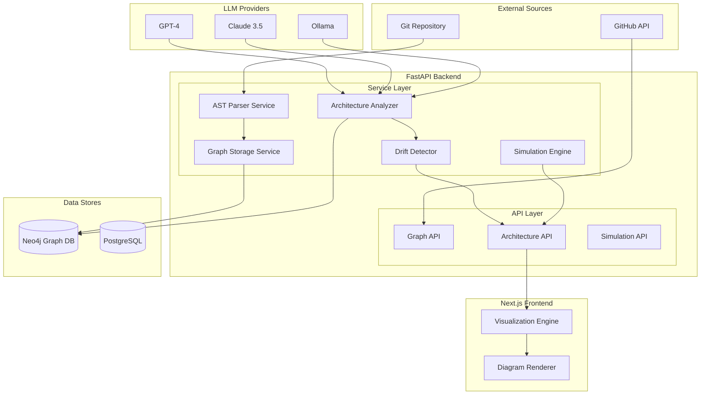

# Graph-based Architecture Analysis

Feature Name: graph-based-architecture
Updated: 2026-03-12

## Description

Graph-based Architecture Analysis provides AST-based code parsing and Neo4j-powered architecture storage, enabling context-aware reasoning for architecture drift detection, dynamic architecture diagram rendering with real-time coupling anomaly warnings, refactoring scenario simulation, and flexible LLM model switching.

## Architecture



## Components and Interfaces

### 1. AST Parser Service

**Responsibility**: Parse source code into AST and extract relationships

**Public Interface**:
- `parse_file(file_path: str, content: str, language: str) -> ASTNode`
- `extract_relationships(ast: ASTNode) -> List[Relationship]`
- `get_imports(ast: ASTNode) -> List[Import]`
- `get_exports(ast: ASTNode) -> List[Export]`
- `get_calls(ast: ASTNode) -> List[FunctionCall]`
- `get_inheritance(ast: ASTNode) -> List[Inheritance]`

**Location**: `backend/services/ast_parser/`

**Supported Parsers**:
- Python: `ast` module + `tree-sitter`
- JavaScript/TypeScript: `tree-sitter`
- Java: `tree-sitter-java`
- Go: `tree-sitter-go`
- Rust: `tree-sitter-rust`

### 2. Graph Storage Service

**Responsibility**: Manage Neo4j graph operations

**Public Interface**:
- `store_nodes(nodes: List[GraphNode]) -> None`
- `store_relationships(rels: List[GraphRelationship]) -> None`
- `query_dependencies(node_id: str) -> List[Dependency]`
- `query_coupling(source: str, target: str) -> CouplingMetrics`
- `get_module_structure(project_id: str) -> ModuleGraph`
- `delete_project(project_id: str) -> None`

**Location**: `backend/services/graph_storage.py`

### 3. Architecture Analyzer

**Responsibility**: Analyze and compare architecture against blueprints

**Public Interface**:
- `analyze_architecture(project_id: str) -> ArchitectureReport`
- `detect_patterns(graph: ModuleGraph) -> List[ArchitecturePattern]`
- `compare_with_blueprint(actual: ModuleGraph, blueprint: Blueprint) -> DriftReport`
- `calculate_coupling_metrics(graph: ModuleGraph) -> CouplingReport`

**Location**: `backend/services/architecture_analyzer.py`

### 4. Drift Detector

**Responsibility**: Detect and report architecture drift

**Public Interface**:
- `detect_drift(project_id: str, rules: List[DriftRule]) -> List[DriftAlert]`
- `check_boundary_violations(graph: ModuleGraph, boundaries: List[Boundary]) -> List[Violation]`
- `get_drift_trends(project_id: str, time_range: TimeRange) -> List[DriftTrend]`

**Location**: `backend/services/drift_detector.py`

### 5. Simulation Engine

**Responsibility**: Simulate refactoring scenarios

**Public Interface**:
- `create_scenario(scenario: RefactoringScenario) -> SimulationResult`
- `simulate_move_function(scenario: MoveFunctionScenario) -> ImpactReport`
- `simulate_extract_module(scenario: ExtractModuleScenario) -> ImpactReport`
- `simulate_merge_classes(scenario: MergeClassesScenario) -> ImpactReport`
- `compare_scenarios(scenarios: List[SimulationResult]) -> ComparisonReport`

**Location**: `backend/services/simulation_engine.py`

### API Endpoints

| Endpoint | Method | Description |
|----------|--------|-------------|
| `/api/v1/projects/{id}/graph` | GET | Get project graph data |
| `/api/v1/projects/{id}/graph/nodes` | GET | Get graph nodes |
| `/api/v1/projects/{id}/graph/edges` | GET | Get graph edges |
| `/api/v1/projects/{id}/architecture` | GET | Get architecture analysis |
| `/api/v1/projects/{id}/drift` | GET | Get architecture drift report |
| `/api/v1/projects/{id}/drift/alerts` | GET | Get active drift alerts |
| `/api/v1/projects/{id}/blueprint` | GET | Get architecture blueprint |
| `/api/v1/projects/{id}/blueprint` | PUT | Update architecture blueprint |
| `/api/v1/projects/{id}/simulate` | POST | Create refactoring simulation |
| `/api/v1/simulations/{id}` | GET | Get simulation result |
| `/api/v1/simulations/{id}/compare` | POST | Compare simulations |

## Data Models

### GraphNode

```python
class GraphNode(BaseModel):
    id: str  # node_id
    project_id: UUID
    node_type: NodeType  # file, class, function, variable, module
    name: str
    fully_qualified_name: str
    file_path: str
    line_number: Optional[int]
    language: str
    metadata: Dict[str, Any]
```

### GraphRelationship

```python
class GraphRelationship(BaseModel):
    id: str
    project_id: UUID
    source_id: str
    target_id: str
    relationship_type: RelType  # imports, exports, calls, inherits, uses
    strength: float  # 0-1 coupling strength
    metadata: Dict[str, Any]
```

### ArchitectureBlueprint

```python
class ArchitectureBlueprint(BaseModel):
    id: UUID
    project_id: UUID
    name: str
    layers: List[Layer]
    boundaries: List[Boundary]
    allowed_dependencies: List[DependencyRule]
    created_at: datetime
    updated_at: datetime
```

### Layer

```python
class Layer(BaseModel):
    name: str
    description: str
    allowed_layers_below: List[str]  # which layers this layer can depend on
    node_patterns: List[str]  # glob patterns for matching nodes
```

### Boundary

```python
class Boundary(BaseModel):
    name: str
    source_pattern: str  # glob pattern
    target_patterns: List[str]  # allowed targets
    violation_action: ViolationAction  # warn, error
```

### DriftAlert

```python
class DriftAlert(BaseModel):
    id: UUID
    project_id: UUID
    severity: Severity  # critical, major, minor
    rule_violated: str
    description: str
    affected_nodes: List[str]
    suggested_fix: str
    detected_at: datetime
    is_resolved: bool
```

### RefactoringScenario

```python
class RefactoringScenario(BaseModel):
    id: UUID
    project_id: UUID
    scenario_type: ScenarioType  # move_function, extract_module, merge_classes
    description: str
    parameters: Dict[str, Any]
    created_at: datetime
```

### ImpactReport

```python
class ImpactReport(BaseModel):
    scenario_id: UUID
    affected_nodes: List[str]
    new_relationships: List[GraphRelationship]
    removed_relationships: List[GraphRelationship]
    changed_dependencies: List[DependencyChange]
    coupling_impact: CouplingMetrics
    risk_level: RiskLevel  # low, medium, high
    warnings: List[str]
```

## Neo4j Schema

### Nodes

```
(:File {id, project_id, path, language})
(:Class {id, project_id, name, file_id})
(:Function {id, project_id, name, file_id, line_start, line_end})
(:Variable {id, project_id, name, file_id})
(:Module {id, project_id, name})
```

### Relationships

```
(:File)-[:IMPORTS]->(:File)
(:Class)-[:INHERITS]->(:Class)
(:Class)-[:HAS_METHOD]->(:Function)
(:Function)-[:CALLS]->(:Function)
(:Function)-[:USES]->(:Variable)
(:Module)-[:CONTAINS]->(:File)
(:Module)-[:DEPENDS_ON]->(:Module)
```

### Indexes

```cypher
CREATE INDEX node_project_idx FOR (n) ON (n.project_id)
CREATE INDEX node_fqn_idx FOR (n) ON (n.fully_qualified_name)
CREATE INDEX rel_project_idx FOR ()-[r]->() WHERE r.project_id
```

## Correctness Properties

### Invariants

1. Every node MUST have a valid project_id reference
2. All relationships MUST reference existing nodes
3. Node IDs MUST be unique within a project
4. Architecture drift alerts MUST reference violated rules

### Constraints

1. Maximum project size: 10,000 files
2. Maximum graph nodes: 1,000,000
3. Maximum graph edges: 5,000,000
4. Simulation time limit: 60 seconds

## Error Handling

| Scenario | Handling |
|----------|----------|
| AST parse failure | Log error, skip file, continue |
| Neo4j connection failure | Retry 3 times, fallback to cached data |
| Invalid blueprint | Return validation errors to user |
| Simulation timeout | Cancel simulation, return partial results |
| LLM unavailable | Use cached analysis or skip AI suggestions |

## Test Strategy

### Unit Tests

- AST parser for each supported language
- Graph storage CRUD operations
- Blueprint validation logic
- Coupling metrics calculation

### Integration Tests

- End-to-end parse and store flow
- Query performance benchmarks
- Drift detection accuracy

### Visualization Tests

- Diagram rendering accuracy
- Real-time update latency
- Interaction responsiveness

## References

[^1]: [Neo4j Python Driver](https://neo4j.com/docs/python-manual/current/)
[^2]: [Tree-sitter](https://tree-sitter.github.io/tree-sitter/)
[^3]: [Architecture Patterns with Python](https://www.oreilly.com/library/view/architecture-patterns-with/9781492032198/)
