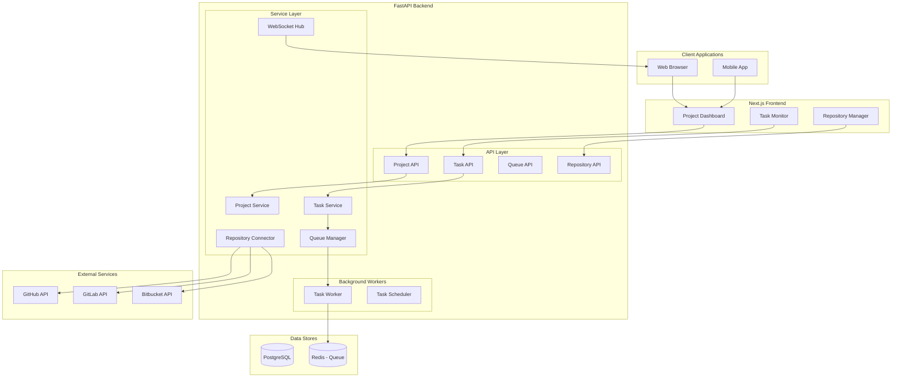
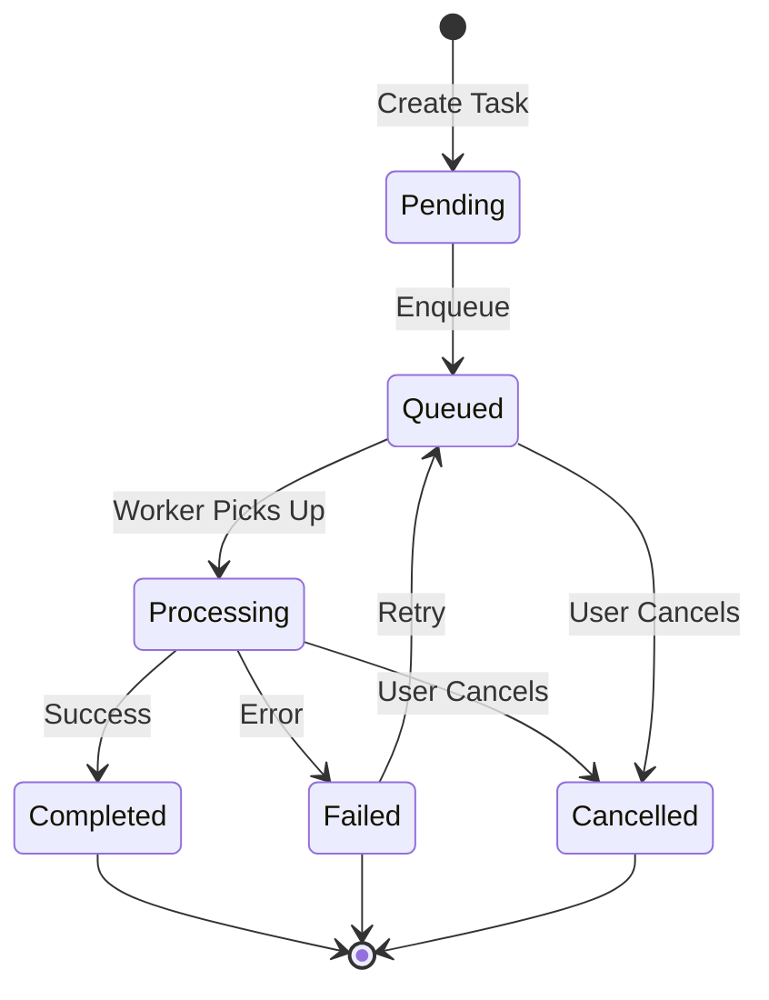

# Project Management

Feature Name: project-management
Updated: 2026-03-12

## Description

Project Management provides comprehensive code analysis task lifecycle management, project management dashboard, analysis queue tracking, code repository connection management, and real-time task flow status monitoring for the AI Code Quality Platform.

## Architecture



## Components and Interfaces

### 1. Project Service

**Responsibility**: Manage project CRUD operations

**Public Interface**:
- `create_project(data: ProjectCreate) -> Project`
- `get_project(project_id: UUID) -> Project`
- `list_projects(filters: ProjectFilters) -> List[Project]`
- `update_project(project_id: UUID, data: ProjectUpdate) -> Project`
- `delete_project(project_id: UUID) -> None`
- `get_project_metrics(project_id: UUID) -> ProjectMetrics`

**Location**: `backend/services/project_service.py`

### 2. Task Service

**Responsibility**: Manage analysis task lifecycle

**Public Interface**:
- `create_task(data: TaskCreate) -> AnalysisTask`
- `get_task(task_id: UUID) -> AnalysisTask`
- `list_tasks(filters: TaskFilters) -> List[AnalysisTask]`
- `cancel_task(task_id: UUID) -> AnalysisTask`
- `retry_task(task_id: UUID) -> AnalysisTask`
- `get_task_progress(task_id: UUID) -> TaskProgress`

**Location**: `backend/services/task_service.py`

### 3. Queue Manager

**Responsibility**: Manage analysis task queue

**Public Interface**:
- `enqueue_task(task_id: UUID, priority: int) -> None`
- `dequeue_task() -> Optional[AnalysisTask]`
- `get_queue_status() -> QueueStatus`
- `reorder_queue(task_id: UUID, new_priority: int) -> None`
- `pause_queue() -> None`
- `resume_queue() -> None`

**Location**: `backend/services/queue_manager.py`

### 4. Repository Connector

**Responsibility**: Connect and sync with code repositories

**Public Interface**:
- `connect_github_repo(repo_url: str, token: str) -> RepoConnection`
- `connect_gitlab_repo(repo_url: str, token: str) -> RepoConnection`
- `connect_bitbucket_repo(repo_url: str, token: str) -> RepoConnection`
- `disconnect_repo(repo_id: UUID) -> None`
- `verify_connection(repo_id: UUID) -> bool`
- `sync_repository(repo_id: UUID) -> SyncResult`

**Location**: `backend/services/repo_connector.py`

### 5. WebSocket Hub

**Responsibility**: Real-time task status updates

**Public Interface**:
- `broadcast_task_update(task_id: UUID, update: TaskUpdate) -> None`
- `broadcast_queue_update(status: QueueStatus) -> None`
- `subscribe(user_id: UUID, project_id: UUID) -> str`
- `unsubscribe(connection_id: str) -> None`

**Location**: `backend/core/websocket.py`

### API Endpoints

| Endpoint | Method | Description |
|----------|--------|-------------|
| `/api/v1/projects` | POST | Create project |
| `/api/v1/projects` | GET | List projects |
| `/api/v1/projects/{id}` | GET | Get project details |
| `/api/v1/projects/{id}` | PUT | Update project |
| `/api/v1/projects/{id}` | DELETE | Delete project |
| `/api/v1/projects/{id}/metrics` | GET | Get project metrics |
| `/api/v1/tasks` | POST | Create analysis task |
| `/api/v1/tasks` | GET | List tasks |
| `/api/v1/tasks/{id}` | GET | Get task details |
| `/api/v1/tasks/{id}/cancel` | POST | Cancel task |
| `/api/v1/tasks/{id}/retry` | POST | Retry failed task |
| `/api/v1/tasks/{id}/progress` | GET | Get task progress |
| `/api/v1/queue/status` | GET | Get queue status |
| `/api/v1/queue/pause` | POST | Pause queue |
| `/api/v1/queue/resume` | POST | Resume queue |
| `/api/v1/repos` | GET | List connected repos |
| `/api/v1/repos/connect` | POST | Connect repository |
| `/api/v1/repos/{id}/disconnect` | POST | Disconnect repository |
| `/api/v1/repos/{id}/sync` | POST | Sync repository |
| `/ws/tasks` | WS | WebSocket for task updates |

## Data Models

### Project

```python
class Project(BaseModel):
    id: UUID
    tenant_id: UUID
    name: str
    slug: str
    description: Optional[str]
    repository_url: Optional[str]
    repository_type: Optional[RepoType]  # github, gitlab, bitbucket
    is_public: bool
    default_branch: str
    settings: ProjectSettings
    metrics: ProjectMetrics
    created_by: UUID
    created_at: datetime
    updated_at: datetime
```

### ProjectSettings

```python
class ProjectSettings(BaseModel):
    auto_analysis: bool
    analysis_on_push: bool
    analysis_on_pr: bool
    excluded_paths: List[str]
    file_size_limit: int
    supported_languages: List[str]
```

### ProjectMetrics

```python
class ProjectMetrics(BaseModel):
    total_analyses: int
    last_analysis_at: Optional[datetime]
    total_issues: int
    critical_issues: int
    major_issues: int
    minor_issues: int
    info_issues: int
    trend: TrendDirection  # improving, stable, degrading
```

### AnalysisTask

```python
class AnalysisTask(BaseModel):
    id: UUID
    project_id: UUID
    task_type: TaskType  # manual, scheduled, webhook
    trigger: str  # push, manual, scheduled
    commit_sha: Optional[str]
    branch: Optional[str]
    status: TaskStatus  # pending, queued, processing, completed, failed, cancelled
    progress: int  # 0-100
    current_stage: TaskStage
    result: Optional[TaskResult]
    error: Optional[TaskError]
    queued_at: Optional[datetime]
    started_at: Optional[datetime]
    completed_at: Optional[datetime]
    created_by: UUID
    created_at: datetime
```

### TaskStatus

```python
class TaskStatus(str, Enum):
    PENDING = "pending"
    QUEUED = "queued"
    PROCESSING = "processing"
    COMPLETED = "completed"
    FAILED = "failed"
    CANCELLED = "cancelled"
```

### TaskStage

```python
class TaskStage(str, Enum):
    QUEUED = "queued"
    FETCHING = "fetching_code"
    PARSING = "parsing_ast"
    ANALYZING = "analyzing_code"
    GENERATING_REPORT = "generating_report"
    COMPLETED = "completed"
```

### TaskProgress

```python
class TaskProgress(BaseModel):
    task_id: UUID
    status: TaskStatus
    progress: int
    current_stage: TaskStage
    stage_progress: Dict[str, int]
    elapsed_time: int  # seconds
    estimated_remaining: Optional[int]
    logs: List[LogEntry]
```

### QueueStatus

```python
class QueueStatus(BaseModel):
    is_paused: bool
    waiting_count: int
    processing_count: int
    completed_today: int
    failed_today: int
    average_wait_time: int  # seconds
    estimated_next_completion: Optional[datetime]
```

### RepoConnection

```python
class RepoConnection(BaseModel):
    id: UUID
    project_id: UUID
    provider: RepoProvider  # github, gitlab, bitbucket
    repo_url: str
    repo_name: str
    default_branch: str
    is_connected: bool
    last_synced_at: Optional[datetime]
    created_at: datetime
```

## Database Schema

### Table: projects

| Column | Type | Description |
|--------|------|-------------|
| id | UUID | PK |
| tenant_id | UUID | FK -> tenants |
| name | VARCHAR(255) | Project name |
| slug | VARCHAR(100) | URL-friendly name |
| description | TEXT | Project description |
| repository_url | VARCHAR(500) | Git repo URL |
| repository_type | VARCHAR(20) | github, gitlab, bitbucket |
| is_public | BOOLEAN | Public/private flag |
| default_branch | VARCHAR(100) | Default branch name |
| settings | JSONB | Project settings |
| created_by | UUID | FK -> users |
| created_at | TIMESTAMP | Creation time |
| updated_at | TIMESTAMP | Last update |

### Table: analysis_tasks

| Column | Type | Description |
|--------|------|-------------|
| id | UUID | PK |
| project_id | UUID | FK -> projects |
| task_type | VARCHAR(20) | manual, scheduled, webhook |
| trigger | VARCHAR(50) | What triggered the task |
| commit_sha | VARCHAR(40) | Git commit SHA |
| branch | VARCHAR(100) | Branch name |
| status | VARCHAR(20) | Current status |
| progress | INTEGER | Progress 0-100 |
| current_stage | VARCHAR(30) | Current processing stage |
| result | JSONB | Task result data |
| error | TEXT | Error message if failed |
| queued_at | TIMESTAMP | When queued |
| started_at | TIMESTAMP | When processing started |
| completed_at | TIMESTAMP | When completed |
| created_by | UUID | FK -> users |
| created_at | TIMESTAMP | Creation time |

### Table: repo_connections

| Column | Type | Description |
|--------|------|-------------|
| id | UUID | PK |
| project_id | UUID | FK -> projects |
| provider | VARCHAR(20) | github, gitlab, bitbucket |
| repo_url | VARCHAR(500) | Repository URL |
| repo_name | VARCHAR(255) | Repository name |
| access_token_encrypted | TEXT | Encrypted access token |
| default_branch | VARCHAR(100) | Default branch |
| is_connected | BOOLEAN | Connection status |
| last_synced_at | TIMESTAMP | Last sync time |
| created_at | TIMESTAMP | Creation time |

## Task Flow



## Correctness Properties

### Invariants

1. Every task MUST be associated with a valid project
2. Task status transitions MUST follow the defined flow
3. Completed tasks MUST have a result or error
4. Repository connections MUST be verified before activation

### Constraints

1. Maximum concurrent processing tasks: 10 (configurable)
2. Maximum queue size: 1000 tasks
3. Maximum task runtime: 30 minutes
4. Maximum retry attempts: 3

## Error Handling

| Scenario | Handling |
|----------|----------|
| Queue full | Return 503, suggest retry later |
| Repository not found | Return 404, suggest re-connect |
| Repository permission denied | Return 403, require re-authentication |
| Task timeout | Mark as failed, log timeout error |
| Worker crash | Restart worker, resume pending tasks |

## Test Strategy

### Unit Tests

- Project CRUD operations
- Task lifecycle state transitions
- Queue priority ordering
- Repository connection verification

### Integration Tests

- End-to-end task processing flow
- WebSocket real-time updates
- Repository sync operations

### Performance Tests

- Dashboard load with 1000 projects
- Queue throughput with 100 concurrent tasks
- WebSocket connection handling
